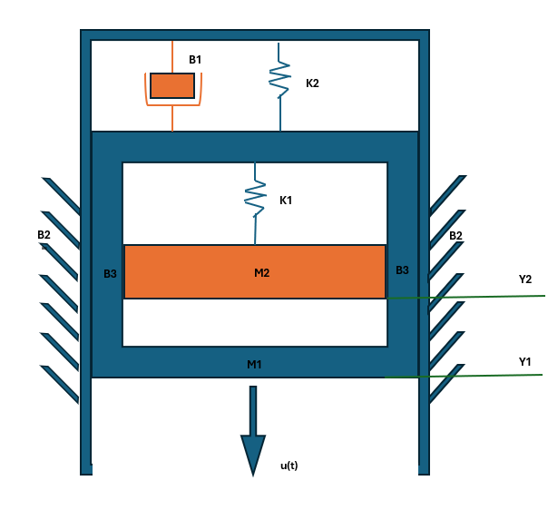
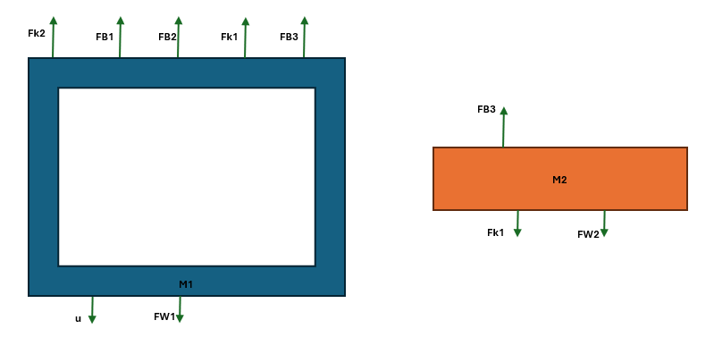

## Primer punto 

### Enunciado

Obtener las ecuaciones diferenciales del siguiente sistemas. Suponga que no hay fricción entre ruedas y las respectivas superficies y que el carro que lleva la masa no tiene masa. U - es una fuerza y X y Y son distancias
  

Se realizan diagramas de cuerpo libre:
 1. Diagrama del carro exterior
   
   

Primera ecuación del sistema es:

$$U - F_k - F_b = 0$$

Sustituyendo las fuerzas del resorte y el amortiguador:

$$U - k(y - x) - b(\dot{y} - \dot{x}) = 0$$

2. Diagrama del carro interior
   
   
   
Segunda ecuación del sistema

$$F_k + F_b = Mma$$

Sustituyendo las expresiones de las fuerzas del resorte y el amortiguador:

$$k(y - x) + b(\dot{y} - \dot{x}) = m\ddot{y}$$

## Segundo punto 
## Análisis de circuito con capacitor

### Enunciado

Para el circuito de la figura, hallar la(s) ecuación(es) diferenciales que permiten obtener la función que describe la corriente en el capacitor de $$0.2 \, \text{F}$$. Asuma que el circuito está totalmente sin energía en \( t = 0 \) y que la fuente de voltaje \( e(t) \) es constante.

---

### Datos del circuito

- $$L_1 = 2\, \text{H}$$
- $$R_1 = 200\, \Omega$$
- $$R_2 = 50\, \Omega$$
- $$R_3 = 20\, \Omega$$
- $$C = 0.2\, \text{F}$$
- $$e(t) = \text{constante}$$
- Corrientes: $$i_1$$ y $$i_2$$

---

### Ecuaciones

Aplicando la Ley de Kirchhoff de Voltajes (KVL) a las dos mallas:

#### Malla izquierda (malla de \( i_1 \)):

$$2 \frac{di_1}{dt} + 200 i_1 + 50(i_1 - i_2) = e(t)$$

Simplificando:

$$2 \frac{di_1}{dt} + 250 i_1 - 50 i_2 = e(t)$$

#### Malla derecha (malla de \( i_2 \)):

$$50(i_2 - i_1) + 20 i_2 + \frac{1}{0.2} \int i_2 \, dt = 0$$

Simplificando:

$$-50 i_1 + 70 i_2 + 5 \int i_2 \, dt = 0$$

Derivando la ecuación para eliminar la integral:

$$-50 \frac{di_1}{dt} + 70 \frac{di_2}{dt} + 5 i_2 = 0$$

---

### Sistema de ecuaciones diferenciales final

$$
\begin{cases}
2 \frac{di_1}{dt} + 250 i_1 - 50 i_2 = e(t) \\
-50 \frac{di_1}{dt} + 70 \frac{di_2}{dt} + 5 i_2 = 0
\end{cases}
$$

## Tercer punto

### Enunciado

1. Obtener las ecuaciones diferenciales del siguiente sistema para que quede u(t) como entrada y "Y1" y "Y2" como salidas. Sabiendo que la masa M2 está suspendida dentro de la masa M1 que tiene una forma parecida a un marco con un espacio en el centro y existe fricción entre ambas, con coeficiente B3. La masa M1 está suspendida dentro de una guía vertical que se mantiene inmóvil y el coeficiente fricción entre las superficies es B2. (Solo se acepta procedimiento completo visto en clase). (2 Puntos)

Se realizan sus respectivos diagramas de cuerpo libre:

    

