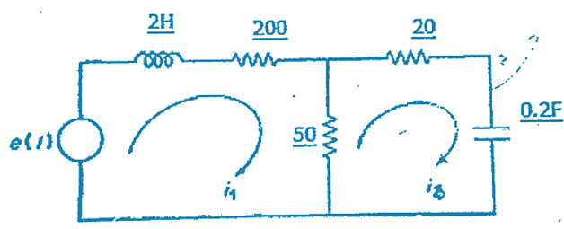

## Primer punto 

### Enunciado

Obtener las ecuaciones diferenciales del siguiente sistemas. Suponga que no hay fricción entre ruedas y las respectivas superficies y que el carro que lleva la masa no tiene masa. U - es una fuerza y X y Y son distancias
  

Se realizan diagramas de cuerpo libre:
 1. Diagrama del carro exterior
   
   

Primera ecuación del sistema es:

$$U - F_k - F_b = 0$$

Sustituyendo las fuerzas del resorte y el amortiguador:

$$U - k(y - x) - b(\dot{y} - \dot{x}) = 0$$

2. Diagrama del carro interior
   
   
   
Segunda ecuación del sistema

$$F_k + F_b = Mma$$

Sustituyendo las expresiones de las fuerzas del resorte y el amortiguador:

$$k(y - x) + b(\dot{y} - \dot{x}) = m\ddot{y}$$

## Segundo punto 
## Análisis de circuito con capacitor

### Enunciado

Para el circuito de la figura, hallar la(s) ecuación(es) diferenciales que permiten obtener la función que describe la corriente en el capacitor de $$0.2 \, \text{F}$$. Asuma que el circuito está totalmente sin energía en \( t = 0 \) y que la fuente de voltaje \( e(t) \) es constante.

---

### Datos del circuito

- $$L_1 = 2\, \text{H}$$
- $$R_1 = 200\, \Omega$$
- $$R_2 = 50\, \Omega$$
- $$R_3 = 20\, \Omega$$
- $$C = 0.2\, \text{F}$$
- $$e(t) = \text{constante}$$
- Corrientes: $$i_1$$ y $$i_2$$

---

### Ecuaciones

Aplicando la Ley de Kirchhoff de Voltajes (KVL) a las dos mallas:

#### Malla izquierda (malla de \( i_1 \)):

$$2 \frac{di_1}{dt} + 200 i_1 + 50(i_1 - i_2) = e(t)$$

Simplificando:

$$2 \frac{di_1}{dt} + 250 i_1 - 50 i_2 = e(t)$$

#### Malla derecha (malla de \( i_2 \)):

$$50(i_2 - i_1) + 20 i_2 + \frac{1}{0.2} \int i_2 \, dt = 0$$

Simplificando:

$$-50 i_1 + 70 i_2 + 5 \int i_2 \, dt = 0$$

Derivando la ecuación para eliminar la integral:

$$-50 \frac{di_1}{dt} + 70 \frac{di_2}{dt} + 5 i_2 = 0$$

---

### Sistema de ecuaciones diferenciales final

$$
\begin{cases}
2 \frac{di_1}{dt} + 250 i_1 - 50 i_2 = e(t) \\
-50 \frac{di_1}{dt} + 70 \frac{di_2}{dt} + 5 i_2 = 0
\end{cases}
$$

## Primer punto parcial 2:

### Enunciado

1. Obtener las ecuaciones diferenciales del siguiente sistema para que quede u(t) como entrada y "Y1" y "Y2" como salidas. Sabiendo que la masa M2 está suspendida dentro de la masa M1 que tiene una forma parecida a un marco con un espacio en el centro y existe fricción entre ambas, con coeficiente B3. La masa M1 está suspendida dentro de una guía vertical que se mantiene inmóvil y el coeficiente fricción entre las superficies es B2. (Solo se acepta procedimiento completo visto en clase). (2 Puntos)

Se realizan sus respectivos diagramas de cuerpo libre:

A partir de los diagramas de cuerpo libre se realizan sus respectivas ecuaciones:

Ecucaion para la primer masa:

$$U+F _{w1} - F _{k2} -F _{B1} -F _{B2} -F _{B3} - F _{k1} = m _{1} * a _{m1}$$

Luego de tener la ecuacion con sus fuerzas continuamos reemplazando cada una por sus caracteristicas dinamicas:

 $$U+ (m _{1} * g) - k _{2} * y _{1(𝑡)} - B _{1} * y _{1(𝑡)} ^{ ' } - B _{2} * y _{1(𝑡)} ^{ ' } - B _{3} * ( y _{1(𝑡)} ^{ ' } -  y _{2(𝑡)} ^{ ' } ) - k _{1} * ( y _{1(𝑡)}  -  y _{2(𝑡)}  ) = m _{1} * y _{1(𝑡)} ^{ '' }$$ 
    
Ecucaion para la segunda masa:

$$F _{k1}+F _{w2} -F _{B3}   = m _{2} * a _{m2}$$

Luego de tener la ecuacion con las fuerzas continuamos reemplazando cada una por sus caracteristicas dinamicas en este caso para la masa 2:

$$k _{1} * ( y _{1(𝑡)}  -  y _{2(𝑡)} ) +(m _{2} * g ) - B _{3} * ( y _{1(𝑡)} ^{ ' } -  y _{2(𝑡)} ^{ ' } )   = m _{2} * y _{2(𝑡)} ^{ '' }$$

Estas serian entonces nuestras 2 ecuaciones finales resultantes:

$$U+ (m _{1} * g) - k _{2} * y _{1(𝑡)} - B _{1} * y _{1(𝑡)} ^{ ' } - B _{2} * y _{1(𝑡)} ^{ ' } - B _{3} * ( y _{1(𝑡)} ^{ ' } -  y _{2(𝑡)} ^{ ' } ) - k _{1} * ( y _{1(𝑡)}  -  y _{2(𝑡)}  ) = m _{1} * y _{1(𝑡)} ^{ '' }$$

$$k _{1} * ( y _{1(𝑡)}  -  y _{2(𝑡)} ) +(m _{2} * g ) - B _{3} * ( y _{1(𝑡)} ^{ ' } -  y _{2(𝑡)} ^{ ' } )   = m _{2} * y _{2(𝑡)} ^{ '' }$$

## Segundo punto parcial 2:

2. Para el circuito de la figura hallar la/s ecuación diferencial que permitiría obtener la función que describe la tensión en la resistencia de 50 Q. Seleccione el método de análisis que prefiera o considere más adecuado. Asuma que el circuito está totalmente sin energía en t=0 y que la fuente de voltaje e(t) es constante. (Solo se acepta procedimiento completo visto en clase) (3 puntos).

### Análisis por el método de nodos

Definimos el nodo entre las resistencias de 200 Ω, 50 Ω y 20 Ω como el nodo \( A \), con voltaje \( v(t) \). Esta tensión es la misma que cae sobre la resistencia de 50 Ω, por lo tanto es la incógnita a hallar.

Aplicamos la Ley de Corrientes de Kirchhoff (LCK) en el nodo \( A \):

---

###  Corriente desde la fuente \( e(t) \) hacia el nodo A:

Esta rama contiene una inductancia de 2 H en serie con una resistencia de 200 Ω. La corriente que llega al nodo desde esta rama se puede expresar como:

$$
i_1 = \frac{e(t) - v(t)}{200} + 2 \cdot \frac{d}{dt}[e(t) - v(t)]
$$

---

###  Corriente a través de la resistencia de 50 Ω:

$$
i_2 = \frac{v(t)}{50}
$$

---

###  Corriente por la rama derecha (20 Ω y capacitor de 0.2 F):

- A través de la resistencia:

$$
i_{R} = \frac{v(t)}{20}
$$

- A través del condensador:

$$
i_C = 0.2 \cdot \frac{dv(t)}{dt}
$$

---

###  Aplicando la LCK en el nodo:

La suma de las corrientes que llegan al nodo debe ser igual a la suma de las que salen:

$$
\frac{e(t) - v(t)}{200} + 2 \cdot \frac{d}{dt}[e(t) - v(t)] = \frac{v(t)}{50} + \frac{v(t)}{20} + 0.2 \cdot \frac{dv(t)}{dt}
$$

Desarrollamos las derivadas del lado izquierdo:

$$
\frac{e(t)}{200} - \frac{v(t)}{200} + 2 \cdot \left( \frac{de(t)}{dt} - \frac{dv(t)}{dt} \right) = \frac{v(t)}{50} + \frac{v(t)}{20} + 0.2 \cdot \frac{dv(t)}{dt}
$$

Agrupamos términos:

Lado izquierdo:

$$
\frac{e(t)}{200} + 2 \cdot \frac{de(t)}{dt} - \left( \frac{v(t)}{200} + 2 \cdot \frac{dv(t)}{dt} \right)
$$

Lado derecho:

$$
\left( \frac{1}{50} + \frac{1}{20} \right) v(t) + 0.2 \cdot \frac{dv(t)}{dt} = \frac{7}{100} v(t) + 0.2 \cdot \frac{dv(t)}{dt}
$$

Reorganizamos la ecuación completa:

$$
\frac{e(t)}{200} + 2 \cdot \frac{de(t)}{dt} = \frac{v(t)}{200} + \frac{7}{100} v(t) + 2 \cdot \frac{dv(t)}{dt} + 0.2 \cdot \frac{dv(t)}{dt}
$$

Sumamos los coeficientes:

- Para \( v(t) \):

$$
\frac{1}{200} + \frac{7}{100} = \frac{1 + 14}{200} = \frac{15}{200} = \frac{3}{40}
$$

- Para \( \frac{dv(t)}{dt} \):

$$
2 + 0.2 = \frac{11}{5}
$$

---

###  Ecuación diferencial final:

$$
\frac{e(t)}{200} + 2 \cdot \frac{de(t)}{dt} = \frac{3}{40} v(t) + \frac{11}{5} \cdot \frac{dv(t)}{dt}
$$

---

###  Caso particular si \( e(t) \) es constante:

Si \( e(t) \) es constante, entonces:

$$
\frac{de(t)}{dt} = 0
$$

Y la ecuación se simplifica a:

$$
\frac{e(t)}{200} = \frac{3}{40} v(t) + \frac{11}{5} \cdot \frac{dv(t)}{dt}
$$

   

