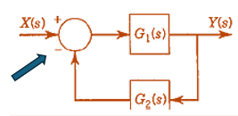
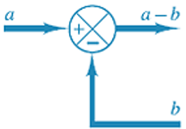
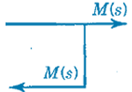
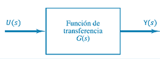
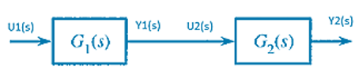
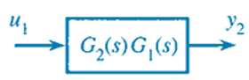
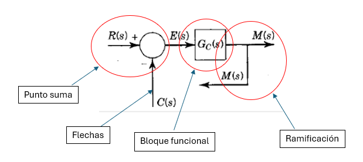

#  Álgebra de Bloques
>🔑 El álgebra de bloques es una técnica utilizada para representar y simplificar sistemas dinámicos mediante el uso de diagramas de bloques en el dominio de Laplace. Permite visualizar cómo se conectan e interactúan distintos subsistemas mediante operaciones matemáticas como sumas, multiplicaciones y retroalimentaciones.

💡 Definición:
- Un **bloque funcional** representa una operación matemática que transforma una señal de entrada en una señal de salida en el dominio de Laplace.
- Si un sistema tiene entrada \( U(s) \) y salida \( Y(s) \), y el bloque tiene una función de transferencia \( G(s) \), entonces:

$$
Y(s) = G(s) \cdot U(s)
$$

- Esta relación implica que el sistema puede analizarse de forma modular, simplificando el estudio del comportamiento dinámico.

>📌 Esta técnica es especialmente útil en sistemas de control, donde se analiza la interacción entre varios bloques como subsistemas individuales conectados entre sí.

##  Elementos de un Diagrama de Bloques
>🔧 Un diagrama de bloques es una representación gráfica que describe el flujo de señales y las relaciones funcionales entre los componentes de un sistema dinámico.

💡 Elementos principales:

### 1. Bloque funcional:
- Representa una operación matemática que transforma una entrada en una salida.
- Se asocia a una **función de transferencia** en el dominio de Laplace.
  
  
  
$$ Y(s) = G(s) \cdot U(s) $$

### 2. Flechas:
- Indican la dirección del flujo de la señal dentro del sistema.
- Muestran explícitamente la propiedad **unidireccional** de las señales.
- La punta que entra al bloque es la **entrada**, la que sale es la **salida**.
- 

### 3. Punto de suma:
- Permite **sumar o restar señales**.
- Se utiliza un signo “+” o “−” para indicar la operación correspondiente.
- Las señales deben tener **las mismas unidades y dimensiones** para combinarse.

### 4. Punto de ramificación:
- Divide una señal para enviarla de forma **concurrente** a múltiples bloques o puntos de suma.
- No altera el valor de la señal, solo la duplica para ser usada en distintos caminos.

> Estos elementos permiten estructurar sistemas complejos de forma modular y facilitar su análisis.

##  Interpretación del Diagrama de Bloques
> La interpretación matemática de un diagrama de bloques permite entender cómo las señales se transforman y propagan a través del sistema. Cada bloque representa una función de transferencia que opera sobre la señal de entrada para generar una salida.

💡 Principio fundamental:
- En el **dominio de Laplace**, cada bloque realiza una **multiplicación** de su entrada por una función de transferencia \( G(s) \):

$$
Y(s) = G(s) \cdot U(s)
$$

- Donde:
  - \( U(s) \): entrada del bloque
  - \( G(s) \): función de transferencia del sistema o subsistema
  - \( Y(s) \): salida del bloque

 Este principio se aplica **a cada bloque del sistema**, permitiendo el análisis por partes y facilitando la reducción de sistemas complejos.

📌 El análisis por bloques es modular: se puede estudiar cada componente por separado y luego reconstruir el comportamiento total del sistema mediante operaciones como:

- **Multiplicación en cascada**
- **Suma algebraica en paralelo**
- **Realimentación positiva o negativa**

 Esta representación permite simplificar el análisis de sistemas complejos sin tener que resolver directamente ecuaciones diferenciales.

##  Bloques en Cascada
> Los bloques en cascada representan una **conexión en serie** entre varios sistemas, donde la salida de un bloque es la entrada del siguiente.

💡 Definición:
- Si dos bloques están conectados en cascada, sus funciones de transferencia se **multiplican**:

### Sistema en cascada:
Se tienen 2 sistemas interconectados:

$$ Y_{1}(s)= U_{1}(s)G_{1}(s) $$
$$ Y_{2}(s)= U_{2}(s)G_{2}(s) $$

$$ Y_{2}(s)= Y_{1}(s)G_{2}(s) $$
$$ Y_{2}(s)= U_{1}(s)G_{1}(s)G_{2}(s) $$

###Ejemplo
Identificar los elementos de sistema de la figura.

