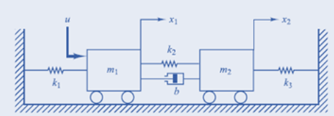
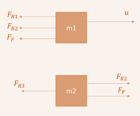
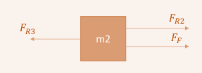

# Sistemas mecánicos 
> 🔑 Los sistemas mecánicos son un conjunto de componentes, elementos o dispositivos físicos cuya función específica es convertir o transmitir el movimiento y la fuerza de entrada generada por alguna fuente de energía, al movimiento y la fuerza de salida que se desea producir. Por tanto, son sistemas que tienen partes móviles.

Figura 1. Representación de sistemas 

## Principio general de modelamiento 
Tasa de acumulación × (Masa o Energía) = Flujo de (Masa o Energía) de Entrada - Flujo de (Masa o Energía) de Salida

## Sitemas mecánicos: 
### Resorte:
> 🔑 Se asumen resortes lineales, la fuerza externa aplicada y el desplazamiento están relacionados por una constante de proporcionalidad.

$$F = kx = k(x_1 - x_2)$$

Donde:
- $$\( F \)$$ es la fuerza.
- $$\( k \)$$ es la constante de elasticidad.
- $$\( (x_1 - x_2) \)$$ es la distancia comprimida o estirada del resorte.
  

Figura 2. Resorte

Figura 3. Gráfica de los tipos de resorte 

### Amortiguador 
> 🔑 Un amortiguador es un elemento que absorbe la energía del sistema. Se utiliza para reducir la transmisión de vibraciones y ruidos.

* Comportamiento lineal, proporcional a la velocidad del desplazamiento. 

Figura 4. Amortiguador 

$$F = b\dot{x} = b(\dot{x}_1 - \dot{x}_2)$$

Donde:
- \( F \) es la fuerza de fricción viscosa.
- \( b \) es la constante de fricción viscosa.
- \( \dot{x} \) es la velocidad.
- \( \dot{x}_1 \) y \( \dot{x}_2 \) son las velocidades relativas de los puntos en contacto.

## Tipos de Fricción
  > 🔑 Es aquella que se presenta cuando un cuerpo con una superficie no lubricada se desliza sobre otra superficie no lubricada.
  * Fricción estática
  * Fricción por deslizamiento
  * Fricción por rodamiento
    
    

    Figura 5. Tipos de fricción  

### Fricción estática 
 > 🔑 Es aquella que se representa cuando un cuerpo con una superficie no lubricada se desliza sobre otra superficie no lubricada.

  

  Figura 6. Fricción estática  

### Fricción por deslizamiento
> 🔑 fricción por deslizamiento como la resistencia que crean dos objetos cualesquiera al deslizarse uno contra el otro . Esta fricción, también conocida como fricción cinética, se define como la fuerza necesaria para mantener una superficie deslizándose sobre otra.

  

  Figura 7. Fricción por deslizamiento   

### Fricción por Rodamiento
> 🔑El rozamiento por rodadura es la fricción que se produce cuando dos cuerpos ruedan o se deslizan entre sí. Se presenta cuando uno de los cuerpos se deforma, o ambos. 

  

  Figura 8. Fricción por rodamiento 
## Sistema masa - resorte - amortiguador 
* $$F_R = k_2 \cdot x \quad \text{→ Ley de Hooke}$$

* $$F_F = k_1 \cdot v_m \quad \text{→ Fricción viscosa}$$

* $$F = m \cdot a \quad \text{→ Leyes de Newton}$$

  

  Figura 9. Sistema masa - resorte
  
### Diagrama de cuerpo libre 
  

  Figura 10. Diagrama de cuerpo libre 
### Solución 

$$u - F_R - F_F = m \cdot a$$

$$F_R = k_2 \cdot y(t)$$

$$u(t) - k_2 \cdot y(t) - F_F = m \cdot a$$

$$F_F = k_1 \cdot \frac{dy(t)}{dt}$$

$$u(t) - k_2 \cdot y(t) - k_1 \cdot \frac{dy(t)}{dt} = m \cdot a$$

$$a = \frac{d^2y(t)}{dt^2}$$

$$u(t) - k_2 \cdot y(t) - k_1 \cdot \frac{dy(t)}{dt} = m \cdot \frac{d^2y(t)}{dt^2}$$

💡**Ejemplo :**
* Encontrar el modelo matemático para el sistema que representa a la suspención de un automóvil.
  
    

     Figura 10. Sistema masa - resorte - amortiguador
### Solución 
#### Diagrama de cuerpo libre: 
  
  
  Figura 11. Diagrama de cuerpo libre, masa - resorte - amortiguador 
## Sistemas mecánicos más complejos
> 🔑 Son aquellos que tienen más de dos elementos de enlace. Se caracterizan por tener partes interconectadas que generan un comportamiento inesperado.

💡**Ejemplo 1:**\

Diagrama de cuerpo libre de cada masa:

| **D.C.L masa 1** | **D.C.L masa 2** |
|------------------|------------------|
|              |                                   |

-Ecuacion para la masa 1:

$$ u - F_{R1} - F_{R2} - F_F = m_1 \cdot a_{m1} $$

La distancia de elongación del resorte 2 depende del movimiento de ambas masas

La velocidad del émbolo del amortiguador del resorte 2 depende del movimiento de ambas masas

Reemplazando valores queda:

$$ u(t) - k_1 x_1(t) - k_2 (x_1(t) - x_2(t)) - b \cdot \frac{d(x_1(t) - x_2(t))}{dt} = m_1 \cdot \frac{d^2 x_1(t)}{dt^2} $$

 
------------------------------------------------------------------------
 
-Ecuacion para la masa 2:

$$ F_{R2} + F_F - F_{R3}= m_2 \cdot a_{m2} $$

La distancia de elongación del resorte 2 depende del movimiento de ambas masas

La velocidad del émbolo del amortiguador del resorte 2 depende del movimiento de ambas masas

Reemplazando valores queda:

$$ k_2 \cdot (x_1(t) - x_2(t)) + b \cdot \frac{d(x_1(t) - x_2(t))}{dt} - k_3 \cdot x_2(t) = m_2 \cdot \frac{d^2 x_2(t)}{dt^2} $$

## Modelo resultante:

$$ u(t) - k_1 x_1(t) - k_2 (x_1(t) - x_2(t)) - b \cdot \frac{d(x_1(t) - x_2(t))}{dt} = m_1 \cdot \frac{d^2 x_1(t)}{dt^2} $$

$$ k_2 \cdot (x_1(t) - x_2(t)) + b \cdot \frac{d(x_1(t) - x_2(t))}{dt} - k_3 \cdot x_2(t) = m_2 \cdot \frac{d^2 x_2(t)}{dt^2} $$
