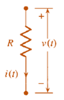
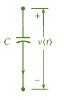
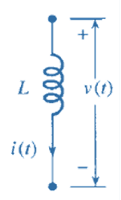

## Sistemas electricos
>🔑los sistemas eléctricos se analizan como un conjunto de componentes y conexiones que interactúan para generar, transportar y distribuir energía eléctrica. Se utilizan modelos matemáticos, como ecuaciones diferenciales y funciones de transferencia, para comprender el comportamiento temporal de estos sistemas bajo diferentes condiciones y cargas. Este análisis permite predecir cómo el sistema eléctrico se comportará ante eventos como la conexión o desconexión de cargas, o fallas en la red.

## Circuito RLC
>🔑 Los circuitos RLC son circuitos eléctricos en los que resistencias , inductores y condensadores se conectan en serie o en paralelo. Su nombre deriva de los símbolos utilizados para representar estos elementos en los diagramas de circuitos: «R» para resistencias, «L» para inductores y «C» para condensadores. 

El fenomeno fisico que modela este comportamiento es las leyes de kirchoff para cada circuito de la siguiente manera:

Ley de Ohm: &nbsp;&nbsp;&nbsp;&nbsp;&nbsp;&nbsp;&nbsp;&nbsp;&nbsp;&nbsp;&nbsp;&nbsp;&nbsp;&nbsp;&nbsp;&nbsp;&nbsp;&nbsp; &nbsp;&nbsp;&nbsp;&nbsp;&nbsp;&nbsp;&nbsp;&nbsp;&nbsp;&nbsp;&nbsp;&nbsp;&nbsp;&nbsp;
Carga de un condensador:
&nbsp;&nbsp;&nbsp;&nbsp;&nbsp;&nbsp;&nbsp;&nbsp;&nbsp;&nbsp;&nbsp;&nbsp;&nbsp;&nbsp;&nbsp;&nbsp;&nbsp;&nbsp; &nbsp;&nbsp;&nbsp;&nbsp;&nbsp;&nbsp;&nbsp;&nbsp;&nbsp;
Carga de un inductor:

 &nbsp;  $$R = \frac{v(t)}{i(t)}$$
&nbsp;&nbsp;&nbsp;&nbsp;&nbsp;&nbsp;&nbsp;&nbsp;&nbsp;&nbsp;&nbsp;&nbsp;&nbsp;&nbsp;&nbsp;&nbsp; &nbsp;&nbsp;&nbsp;&nbsp;&nbsp;&nbsp;&nbsp;&nbsp;&nbsp; &nbsp;  $$i(t) = C\frac{dv(t)}{dt}$$
&nbsp;&nbsp;&nbsp;&nbsp;&nbsp;&nbsp;&nbsp;&nbsp;&nbsp;&nbsp;&nbsp;&nbsp;&nbsp;&nbsp;&nbsp;&nbsp;&nbsp;&nbsp; &nbsp;&nbsp;&nbsp;&nbsp;&nbsp;&nbsp;&nbsp;&nbsp;&nbsp;&nbsp;&nbsp; &nbsp;  $$v(t) = L\frac{di(t)}{dt}$$
