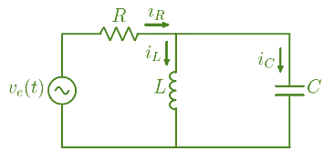

## Sistemas electricos
>🔑los sistemas eléctricos se analizan como un conjunto de componentes y conexiones que interactúan para generar, transportar y distribuir energía eléctrica. Se utilizan modelos matemáticos, como ecuaciones diferenciales y funciones de transferencia, para comprender el comportamiento temporal de estos sistemas bajo diferentes condiciones y cargas. Este análisis permite predecir cómo el sistema eléctrico se comportará ante eventos como la conexión o desconexión de cargas, o fallas en la red.

## Circuito RLC
>🔑 Los circuitos RLC son circuitos eléctricos en los que resistencias , inductores y condensadores se conectan en serie o en paralelo. Su nombre deriva de los símbolos utilizados para representar estos elementos en los diagramas de circuitos: «R» para resistencias, «L» para inductores y «C» para condensadores. 

El fenomeno fisico que modela este comportamiento es las leyes de kirchoff para cada circuito de la siguiente manera:

Ley de Ohm: &nbsp;&nbsp;&nbsp;&nbsp;&nbsp;&nbsp;&nbsp;&nbsp;&nbsp;&nbsp;&nbsp;&nbsp;&nbsp;&nbsp;&nbsp;&nbsp;&nbsp;&nbsp; &nbsp;&nbsp;&nbsp;&nbsp;&nbsp;&nbsp;
Carga de un condensador:
&nbsp;&nbsp;&nbsp;&nbsp;&nbsp;&nbsp;&nbsp;&nbsp;&nbsp;&nbsp;&nbsp;&nbsp;&nbsp;&nbsp;&nbsp;&nbsp;&nbsp;&nbsp; &nbsp;&nbsp;&nbsp;&nbsp;
Carga de un inductor:

 &nbsp;  $$R = \frac{v(t)}{i(t)}$$
&nbsp;&nbsp;&nbsp;&nbsp;&nbsp;&nbsp;&nbsp;  &nbsp;  $$i(t) = C\frac{dv(t)}{dt}$$
&nbsp;&nbsp;&nbsp;&nbsp;&nbsp;&nbsp;&nbsp;&nbsp;&nbsp;&nbsp;  &nbsp;  $$v(t) = L\frac{di(t)}{dt}$$
 

### 💡*Ejemplo 1:*

 

### Aplicando ley de Kirchhoff

$$
-u(t) + v_R + v_L + v_C = 0
$$

$$
-u(t) + i(t) \cdot R + L \frac{di(t)}{dt} + y(t) = 0
$$

 Aún no está en términos de la variable \( y \)

$$
i(t) = C \frac{dy(t)}{dt}
$$

Sustituyendo en la ecuación:

$$
-u(t) + C \frac{dy(t)}{dt} \cdot R + L \frac{d}{dt} \left( C \frac{dy(t)}{dt} \right) + y(t) = 0
$$

Y simplificando:

$$
-u(t) + RC \frac{dy(t)}{dt} + LC \frac{d^2 y(t)}{dt^2} + y(t) = 0
$$

### 💡*Ejemplo 2:*
Obtener el modelo para el circuito de la figura:

 

$$ Y=V_{R_2}+V_c $$
$$ -u(t)+V_{R_1}+V_{R 2}+V_c=0 $$
$$ -u(t) I\left(R_1+R_2\right)+V_c=0 $$
$$ I=I_c+C \frac{d V_c}{d t} $$
$$ -u(t)+\left(R_1+R_2\right) c \frac{d V_c}{d t}+V_c=0 $$

Para poder simplipicar más Vc realizamos nodos. 

$$ \frac{U-Y}{R_1}=\frac{Y-V_c}{R_2} \Rightarrow \frac{V_c}{R_2}=y\left(\frac{1}{R_1}+\frac{1}{R_2}\right)-\frac{u}{R_1} $$

$$ v_c=y\left(\frac{R_2}{R_1}+1\right)-\frac{R_2}{R_1} u$$
$$ \frac{d v_c}{d t}=\frac{d y}{d t}\left(\frac{R_2}{R_1}+1\right)-\frac{R_2}{R_1} \cdot \frac{d u}{d t} $$

Reemplazando:

$$ -u(t)+\left(R_1+R_2\right) c \frac{d y}{d t}\left(\frac{R_2}{R_2}+1\right)-\frac{R_2}{R_1} \frac{du}{d_t}+y\left(\frac{R_2}{R_1}+1\right)-\frac{R_2}{R_1} u=0 $$

### 💡*Ejemplo 3:*
Aplicando nodos: 
 

Aplicando ley de Kirchhoff de corrientes (LKC)

$$ i_u - i_1 - i_c = 0 $$

$$ i_u(t) - \frac{V_{AB}}{0.5} - 2 \frac{dy(t)}{dt} = 0 $$

### Sustituyendo \( V_{AB} \)

$$ V_{AB} = i_c \cdot 1 + y(t) $$

$$ V_{AB} = 2 \frac{dy(t)}{dt} + y(t) $$

$$ u(t)-\frac{2}{0,5} \frac{d y(t)}{d t}-\frac{1}{0,5} y(t)-2 \frac{d y(t)}{d t}=0 $$

### Ecuación final del sistema:

$$ \boxed{u(t) - 6 \frac{dy(t)}{dt} - 2y(t) = 0} $$

### 💡*Ejemplo 4:*

 

$$ I_1+I_2+I_3=0 $$
$$ \frac{e_i-e_x}{R_1}+C_1 * \frac{d(0-e_x)}{d t}+\frac{e_0-e_x}{R_2})=0 $$
$$ \Sigma v=$$
$$ -e_x=V_{R_2}+e_0 $$
$$ -e_x=R_2 I_3+e_0 $$
 
$$ I_3=C_2 \frac{d e_0}{d t} $$
$$ -e_x=R_2 C_2 \frac{d e_0}{d t}+e_0 $$

$$ -\frac{d e_x}{d t}=R_2 C_2 \frac{d^2 e_0}{d t^2}+\frac{d e_0}{d t} $$
$$ \text { Reemplazando queda esta ecuación final: } $$
$$ \frac{e_i}{R_1}+\frac{R_2 C_2}{R_1} \frac{d e_0}{d t}+\frac{1}{R_1} e_0+R_2 C_2 C_1 \frac{d^2 e_0}{d t^2}+\frac{d e_0}{d t} + \frac{e_0}{R_2} + C_2 \frac{de_0}{d t} + \frac{e_0}{R_2} $$

## 📚Ejercicio 1 (Propio):
 

Para este caso utilizaremos el metodo de mallas.

Realizamos el analisis de cada una: 

Malla 1:

$$ Ve = V_{R} + V_{L} $$

Malla 2:

$$V_{L} = V_{C} $$

Nodo comun:

$$ i_{R} = i_{L} + i_{C} $$

Colocamos las ecuaciones de referencia: 

$$ i_C=C \frac{d V_C}{d t} $$
$$ V_L=L \frac{d i_L}{d t} $$
$$ i_R=\frac{V_R}{R} $$

Sustituimos valores en la primer malla:

$$ V_e=\dot{i}_R \cdot R+V_L $$
$$ V_e=\left(i_L+i_C\right) \cdot R+V_L $$
$$ V_e=\left(i_L+C \frac{d V_C}{d t}\right) \cdot R+V_L $$

derivamos en ambos lados para reemplazar i_L.

$$ \frac{d}{d t} V_e=\frac{d}{d t}\left(i L+C \frac{d V_c}{d t}\right) \cdot R+\frac{d}{d t} V_L $$
$$ \frac{d}{d t} V_e=\frac{d}{d t} i_L+ C \frac{d^2 V_c}{d t^2} \cdot R+\frac{d}{d t} V_L $$
$$ \frac{d}{d t} V_e=\left(\frac{V_L}{L}+ C \frac{d^2 V_c}{d t^2}\right) \cdot R+\frac{d}{d t} V_L $$
$$ \frac{d}{d t} V_e=\frac{V_c}{L}+ C \left(\frac{d^2 V_c}{d t^2}\right) \cdot R+\frac{d}{d t} V_c $$

Aplicamos la Place:

$$ S V_e(s)=\frac{R}{L} V_C(s)+R \cdot C \cdot S^2 V_c(s)+S V_C(s) $$

Utilizamos Factor comun para simplificar más la ecuación:

$$ S v_e(s)=V_{C(s)} \frac{R}{L}+R \cdot C \cdot s^2+S  $$

Multiplicamos por L para quitar fracciones:

$$ L \cdot S V_{e(s)}=V_{C(s)}\left(\frac{L R}{L}+R L C S^2+L S\right) $$

despejamos en terminos de entradas y salidas para obtener la ecuación final :

$$ \frac{V_c{(s)}}{V_{e(s)}}=\frac{L S}{R+R L C s^2+L S} $$

## 📚Ejercicio 2 (Propio):

