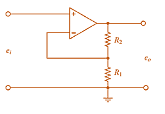
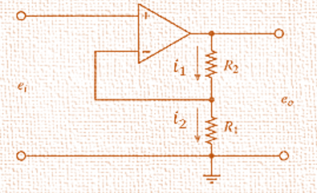
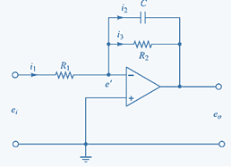
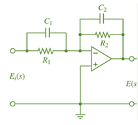

## Amplificadores operacionales
>🔑Un amplificador operacional (AOP o op-amp) es un circuito integrado electrónico de alta ganancia con dos entradas y una salida. Se utiliza para amplificar señales, realizar operaciones matemáticas (suma, resta, integración, diferenciación) y otras tareas en circuitos analógicos y digitales.

## Amplificador no inversor:

>🔑Este tipo de configuración se caracteriza por tener conectado la señal de entrada (voltaje) a la terminal no inversora, esto nos indica que la ganancia será positiva (al contrario del inversor). También tiene como característica una realimentación negativa (conocida normalmente como Rf ). En esta configuración la entrada está en fase con la salida, es decir, no hay desfase en señal alterna, a diferencia de la configuración inversora. Otra característica es que la ganancia siempre será mayor a 1.

 

La tension en ambas entradas del amplificador son iguales V+ = V-.
La corriente a las entradas del amplificador es 0.
La impedancia de entrada es muy grande.
La impedancia de salida es muy pequeña.

 

$$ i_1-i_2=0 $$
$$ \frac{e_o-e_i}{R_2}-\frac{e_i}{R_1}=0 $$
$$ \frac{e_o}{R_2}=e_i\left(\frac{1}{R_2}+\frac{1}{R_1}\right) $$
$$ e_o=e_i\left(1+\frac{R_2}{R_1}\right) $$

## ahora se muestra un circuito con elementos que almacenan energía: 

 

$$
i_1-i_2-i_3=0
$$
$$
\begin{gathered}
\frac{e_i-e^{\prime}}{R_1}-\frac{e^{\prime}-e_o}{R_2}-C \frac{d\left(e^{\prime}-e_o\right)}{d t}=0 \\
e^{\prime}=0 \\
\frac{e_i}{R_1}-\frac{-e_o}{R_2}-C \frac{d\left(-e_o\right)}{d t}=0 \\
\frac{e_i}{R_1}=-\frac{e_o}{R_2}-C \frac{d\left(e_o\right)}{d t}
\end{gathered}
$$

### 💡*Ejemplo 1:*
Obtener el modelo matematico para el circuito de la figura: 
 

Se realiza la sumatoria de corrientes:

$$ I_1+I_2-I_3-I_4=0 $$

Se sustituyen valores:

$$ C_1 \frac{d\left(E_i-V_x\right)}{d t}+\frac{E_i-V_x}{R_1}-C_2 \frac{d\left(V_x-E_{(s)}\right)}{d t}-\frac{V_x-E_s}{R_2}=0 $$

Ecuación resultante:

$$ C_1 \frac{d E_i}{d t}+\frac{E_i}{R_1}+ C_2 d \frac{E_s}{dt}+\frac{E_s}{R_2}=0 $$

#  Sistemas Hidráulicos de Tanques
> 🔑 Son  aquellos  sistemas  en  los  que  seproduce  una  circulación  de  líquido  a  lolargo  de  los  elementos  que  forman  elsistema bajo la acción de diferencias depresión.  Los  caudales  de  líquido  y  ladiferencia  de  presiones  son  lasmagnitudes  que  se  pretenden  modelar.Las  ecuaciones  de  balance  surgen  de  laley de conservación de masa.

##  Parámetros y Variables

- $$qi$$: Flujo de entrada al tanque.  
- $$q1$$: Flujo de salida del tanque.  
- $$R1$$: Resistencia hidráulica al flujo.  
- $$A1$$: Área transversal del tanque.  
- $$h1$$: Altura o nivel de líquido en el tanque.
  

- Flujo de salida del tanque
$$q_1 = \frac{h_1}{R_1}$$

- Intercambio de energía

$$A_1 \frac{dh_1}{dt} = q_i - q_1$$

## Modelado de un Tanque Hidráulico

### Modelo con $$q_i$$ como entrada y $$h_1$$ como salida

- Flujo de salida del tanque:

  $$q_1 = \frac{h_1}{R_1}$$

- Intercambio de energía:

  $$A_1 \frac{dh_1}{dt} = q_i - q_1$$

- Reemplazando:

  $$A_1 \frac{dh_1}{dt} = q_i - \frac{h_1}{R_1}$$

  $$q_1 = \frac{h_1}{R_1}$$

  $$A_1 \frac{dh_1}{dt} = q_i - q_1$$

- Se despeja $$h_1$$:

  $$h_1 = q_1 \cdot R_1$$

  $$\frac{dh_1}{dt} = R_1 \frac{dq_1}{dt}$$

- Reemplazando:

  $$R_1 A_1 \frac{dq_1}{dt} = q_i - q_1$$

## Dos tanques 

- Tanque 1

$$q_1 = \frac{h_1}{R_1} \Rightarrow h_1 = q_1 R_1$$

$$A_1 \frac{dh_1}{dt} = q_i - q_1$$

- Sustituyendo $$h_1 = q_1 R_1$$:

$$A_1 R_1 \frac{dq_1}{dt} = q_i - q_1$$

- Tanque 2

$$q_2 = \frac{h_2}{R_2}$$

$$A_2 \frac{dh_2}{dt} = q_1 - q_2$$

- Sustituyendo $$q_2$$:

$$q_1 = A_2 \frac{dh_2}{dt} + \frac{h_2}{R_2}$$

Multiplicando por $$R_2$$:

$$A_2 R_2 \frac{dh_2}{dt} + h_2 = q_1 R_2$$

- Función
  
$$A_2 R_2 \frac{d^2 h_2}{dt^2} + \frac{dh_2}{dt} = \frac{dq_1}{dt} R_2$$

## Tanques interconectados

- Ecuaciones base:

$$q_1 = \frac{h_1 - h_2}{R_1} \qquad q_2 = \frac{h_2}{R_2}$$

$$A_1 \frac{dh_1}{dt} = (q_i - q_1) \qquad A_2 \frac{dh_2}{dt} = (q_1 - q_2)$$

$$R_2 A_2 \frac{dq_2}{dt} = (q_1 - q_2)$$

$$R_2 A_2 \frac{dq_2}{dt} + q_2 = q_1$$

$$A_1 \frac{dh_1}{dt} = \left( q_i - R_2 A_2 \frac{dq_2}{dt} + q_2 \right)$$

$$R_1 \left( R_2 A_2 \frac{dq_2}{dt} + q_2 \right) + R_2 q_2 = h_1$$

$$A_1 \frac{d}{dt} \left( R_1 \left( R_2 A_2 \frac{dq_2}{dt} + q_2 \right) + R_2 q_2 \right) = \left( q_i - R_2 A_2 \frac{dq_2}{dt} + q_2 \right)$$

### Ecuación final del sistema:

$$A_1 R_1 R_2 A_2 \frac{d^2 q_2}{dt^2} + \left( A_1 R_1 + A_1 R_2 + R_2 A_2 \right) \frac{dq_2}{dt} - q_2 = q_i$$

## Actividad 
- Desarrollar el modelo con $$h_2$$ como salida
  
 

## Ecuaciones del sistema

### Flujo de salida del segundo tanque
$$q_2 = \frac{h_2}{R_2}$$

###  Ecuación de conservación de masa en el segundo tanque
$$A_2 \frac{dh_2}{dt} = q_1 - q_2$$

### Flujo entre los tanques
$$q_1 = \frac{h_1 - h_2}{R_1}$$

$$A_1 \frac{dh_1}{dt} = q_i - q_1$$

$$h_1 = R_1 q_1 + h_2$$

$$A_1 \frac{d}{dt}(R_1 q_1 + h_2) = q_i - q_1$$

$$A_1 \frac{d}{dt}\left(R_1 \left(A_2 \frac{dh_2}{dt} + q_2\right) + h_2\right) = q_i - \left(A_2 \frac{dh_2}{dt} + q_2\right)$$

### Ecuación final con $$h_2$$ como salida

$$A_1 R_1 A_2 \frac{d^2 h_2}{dt^2} + (A_1 R_1 + A_1 A_2 + R_2 A_2) \frac{dh_2}{dt} + \frac{h_2}{R_2} = q_i$$

 - Deducción del voltaje de salida $$V_o$$ de un amplificador 

Igualdades asumidas:

- $$I_1 = I_3$$
- $$I_2 = I_4$$
- $$V_{x1} = V_{x2}$$

Análisis del nodo izquierdo (entrada $$V_1$$):

Ley de Ohm aplicada al nodo:

$$\frac{V_1 - V_{x1}}{R_1} = \frac{V_{x1}}{R_x}$$

$$\frac{V_1}{R_1} = \frac{V_{x1}}{R_x} + \frac{V_{x1}}{R_1}$$

$$\frac{V_1}{R_1} = V_{x1} \left( \frac{1}{R_1} + \frac{1}{R_x} \right)$$

$$\frac{V_1}{R_1} = \frac{V_{x1}(R_1 + R_x)}{R_1 R_x}$$

$$V_{x1} = \frac{V_1 R_x}{R_1 + R_x}$$

Análisis del nodo derecho (entrada $$V_2$$ y salida $$V_o$$):

$$\frac{V_2 - V_{x2}}{R_2} = \frac{V_{x2} - V_o}{R_f}$$

$$(V_2 - V_{x2})R_f = (V_{x2} - V_o)R_2$$

$$V_2 R_f - V_{x2} R_f = V_{x2} R_2 - V_o R_2$$

$$V_2 R_f + V_o R_2 = V_{x2}(R_f + R_2)$$

$$V_{x2} = \frac{V_2 R_f + V_o R_2}{R_2 + R_f}$$

Igualamos los nodos: $$V_{x1} = V_{x2}$$

$$\frac{V_1 R_x}{R_1 + R_x} = \frac{V_2 R_f + V_o R_2}{R_2 + R_f}$$

$$V_1 R_x (R_2 + R_f) = (V_2 R_f + V_o R_2)(R_1 + R_x)$$

$$V_1 R_x R_2 + V_1 R_x R_f$$

$$V_2 R_f R_1 + V_2 R_f R_x + V_o R_2 R_1 + V_o R_2 R_x$$

$$V_1 R_x (R_2 + R_f) - V_2 R_f (R_1 + R_x) = V_o R_2 (R_1 + R_x)$$

$$V_o = \frac{R_x(R_2 + R_f)}{R_2(R_1 + R_x)} V_1 - \frac{R_f}{R_2} V_2$$

## Expresión final:

$$V_o = \frac{R_x(R_2 + R_f)}{R_2(R_1 + R_x)} V_1 - \frac{R_f}{R_2} V_2$$

